<h2>TensorFlow-FlexUNet-Image-Segmentation-Hippocampus-T1W (2026/02/23)</h2>
Sarah T.  Arai 
Software Laboratory antillia.com  
This is the first experiment of Image Segmentation for <b>Hippocampus-T1W (Abdominal Multi-Organ Ultrasound)</b> based on our <a href="./src/TensorFlowFlexUNet.py">TensorFlowFlexUNet</a> 
(TensorFlow Flexible UNet Image Segmentation Model for Multiclass), 
and a 512x512 pixels 
<a href="https://drive.google.com/file/d/1YpEpjweeju_n86Tcjyi3pxY1yLNPmFi9/view?usp=sharing">
<b>Hippocampus-T1W-ImageMask-Dataset.zip</b></a> which was derived by us from   
<a href="https://www.kaggle.com/datasets/andrewmvd/hippocampus-segmentation-in-mri-images">
<b>Hippocampus Segmentation in MRI Images</b> </a> on the kaggle.com.
   

<b>Actual Image Segmentation for Hippocampus-T1W Images of  512x512 pixels </b> 
As shown below, the inferred masks predicted by our segmentation model trained by the dataset appear similar to the ground truth masks.
  
<table>
<tr>
<th>Input: image</th>
<th>Mask (ground_truth)</th>
<th>Prediction: inferred_mask</th>
</tr>
<tr>
<td>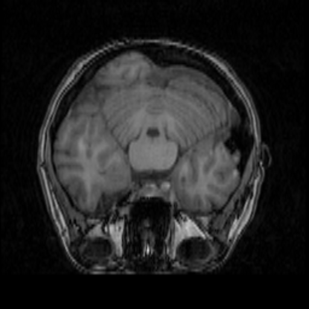</td>
<td></td>
<td></td>
</tr>

<tr>
<td>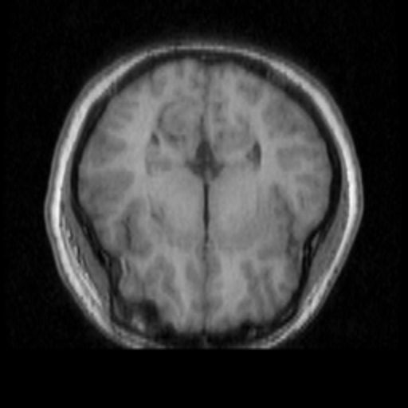</td>
<td></td>
<td></td>
</tr>

<tr>
<td>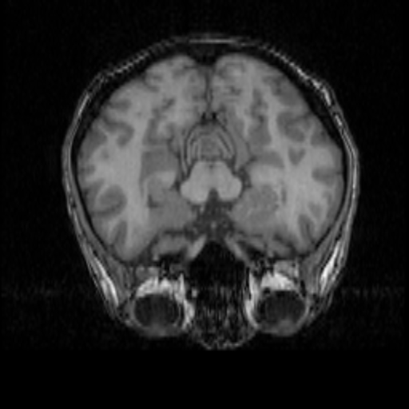</td>
<td></td>
<td></td>
</tr>
</table>

 
<h3>1  Dataset Citation</h3>
The dataset used here was derived from   
<a href="https://www.kaggle.com/datasets/andrewmvd/hippocampus-segmentation-in-mri-images">
<b>Hippocampus Segmentation in MRI Images</b> </a>  
<b>50 T1-weighted MR images with 25 Hippocampus Masks for Segmentation</b> 
on the kaggle.com.
  
The following explanation was taken from above kaggle web site.
  
<b>About Dataset</b> 
<b>Introduction</b> 
The hippocampus is a structure within the brain that plays important roles in the consolidation of information from short-term memory to long-term memory, 
and in spatial memory that enables navigation.  
Magnetic resonance imaging is often the optimal modality for brain medical imaging studies, being T1 ideal for representing structure. 
The hippocampus has become the focus of research in several neurodegenerative disorders.  
Automatic segmentation of this structure from magnetic resonance (MR) imaging scans of the brain facilitates this work, especially in resource poor environments.
  
<b>About This Dataset</b> 
<b>This dataset contains T1-weighted MR images of 50 subjects, 40 of whom are patients with temporal lobe epilepsy and 10 are nonepileptic subjects. </b> 
Hippocampus labels are provided for 25 subjects for training.
   
For more information about the dataset, please refer to: 
<a href="https://pmc.ncbi.nlm.nih.gov/articles/PMC4501402/">
<b>DATASET OF MAGNETIC RESONANCE IMAGES OF NONEPILEPTIC SUBJECTS AND TEMPORAL LOBE EPILEPSY PATIENTS FOR VALIDATION OF HIPPOCAMPAL SEGMENTATION TECHNIQUES
</b></a>.
  
<b>Original Article</b> 
K. Jafari-Khouzani, K. Elisevich, S. Patel, and H. Soltanian-Zadeh,  
 “Dataset of magnetic resonance images of nonepileptic subjects and temporal lobe epilepsy patients for validation of hippocampal segmentation techniques,” 
 Neuroinformatics, 2011.
  
<b>License</b> 
The dataset is free to use for research and education. 
 
 
<b>Dataset BibTeX</b> 
<pre>
@article{,
    title= {MRI Dataset for Hippocampus Segmentation (HFH) (hippseg_2011)},
    keywords= {},
    author= {K. Jafari-Khouzani and K. Elisevich, S. Patel and H. Soltanian-Zadeh},
    abstract= {This dataset contains T1-weighted MR images of 50 subjects, 40 of whom are patients with temporal lobe epilepsy and 10 are nonepileptic subjects. Hippocampus labels are provided for 25 subjects for training. The users may submit their segmentation outcomes for the remaining 25 testing images to get a table of segmentation metrics.},
    terms= {The dataset is free to use for research and education. Please refer to the following article if you use it in your publications:
    K. Jafari-Khouzani, K. Elisevich, S. Patel, and H. Soltanian-Zadeh, “Dataset of magnetic resonance images of nonepileptic subjects and temporal lobe epilepsy patients for validation of hippocampal segmentation techniques,” Neuroinformatics, 2011.},
    license= {free to use for research and education},
    superseded= {},
    url= {https://www.nitrc.org/projects/hippseg_2011/}
}
</pre>
 
<h3>
2 Hippocampus-T1W ImageMask Dataset
</h3>
 If you would like to train this Hippocampus-T1W Segmentation model by yourself,
please down load our dataset <a href="https://drive.google.com/file/d/1YpEpjweeju_n86Tcjyi3pxY1yLNPmFi9/view?usp=sharing">
<b>Hippocampus-T1W-ImageMask-Dataset.zip</b>
</a> on the google drive, expand the downloaded, and put it under <b>./dataset/</b> to be.
<pre>
./dataset
└─Hippocampus-T1W
    ├─test
    │   ├─images
    │   └─masks
    ├─train
    │   ├─images
    │   └─masks
    └─valid
        ├─images
        └─masks
</pre>

 
<b>Hippocampus-T1W Statistics</b> 
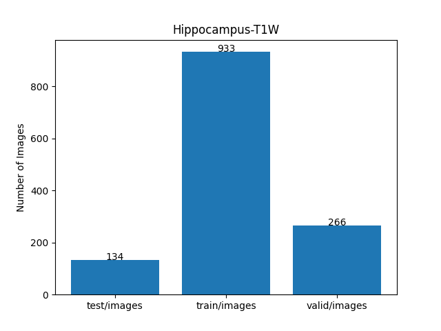 
 
As shown above, the number of images of train and valid datasets is not enough to use for a training set of our segmentation model.
  

<b>Train_images_sample</b> 
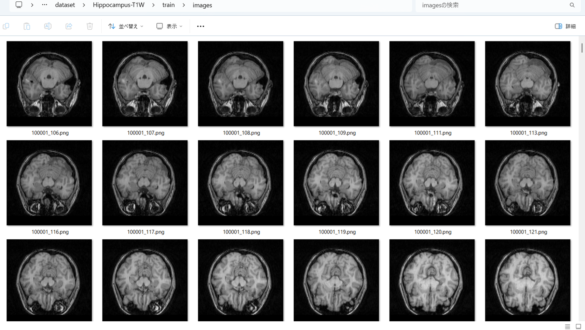
 
<b>Train_masks_sample</b> 
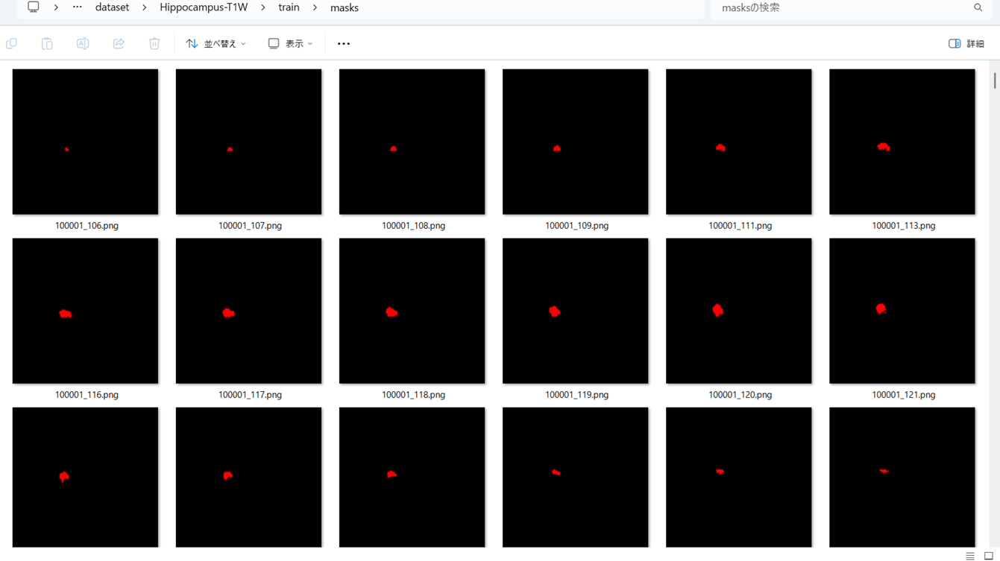
 
<h3>
3 Train TensorflowFlexUNet Model
</h3>
 We trained Hippocampus-T1W TensorflowFlexUNet Model by using the following
<a href="./projects/TensorFlowFlexUNet/Hippocampus-T1W/train_eval_infer.config"> <b>train_eval_infer.config</b></a> file.  
Please move to ./projects/TensorFlowFlexUNet/Hippocampus-T1W, and run the following bat file. 
<pre>
>1.train.bat
</pre>
, which simply runs the following command. 
<pre>
>python ../../../src/TensorFlowFlexUNetTrainer.py ./train_eval_infer.config
</pre>

<b>Model parameters</b> 
Defined a small <b>base_filters=16</b> and a large <b>base_kernels=(11,11)</b> for the first Conv Layer of Encoder Block of 
<a href="./src/TensorFlowFlexUNet.py">TensorFlowFlexUNet.py</a> 
and a large num_layers (including a bridge between Encoder and Decoder Blocks).
<pre>
[model]
image_width    = 512
image_height   = 512
image_channels = 3
input_normalize = True
normalization  = False
num_classes    = 2
base_filters   = 16
base_kernels  = (11,11)
num_layers    = 8
dropout_rate   = 0.05
dilation       = (1,1)
</pre>
<b>Learning rate</b> 
Defined a small learning rate.  
<pre>
[model]
learning_rate  = 0.00007
</pre>
<b>Loss and metrics functions</b> 
Specified "categorical_crossentropy" and "dice_coef_multiclass". 
<pre>
[model]
loss           = "categorical_crossentropy"
metrics        = ["dice_coef_multiclass"]
</pre>
<b >Learning rate reducer callback</b> 
Enabled learing_rate_reducer callback, and a small reducer_patience.
<pre> 
[train]
learning_rate_reducer = True
reducer_factor     = 0.5
reducer_patience   = 4
</pre>
<b>Early stopping callback</b> 
Enabled early stopping callback with patience parameter.
<pre>
[train]
patience      = 10
</pre>
<b></b> 
<b>RGB color map</b> 
rgb color map dict for Hippocampus-T1W 1+1 classes. 
<pre>
[mask]
mask_file_format = ".png"
;Hippocampus-T1W 1+1
rgb_map = {(0,0,0):0, (255,0,0):1}
</pre>
<b>Epoch change inference callbacks</b> 
Enabled epoch_change_infer callback. 
<pre>
[train]
epoch_change_infer       = True
epoch_change_infer_dir   =  "./epoch_change_infer"
epoch_changeinfer        = False
epoch_changeinfer_dir    = "./epoch_changeinfer"
num_infer_images         = 6
</pre>
By using this epoch_change_infer callback, on every epoch_change, the inference procedure can be called
 for 6 images in <b>mini_test</b> folder. This will help you confirm how the predicted mask changes 
 at each epoch during your training process.    
<b>Epoch_change_inference output at starting (1,2,3)</b> 
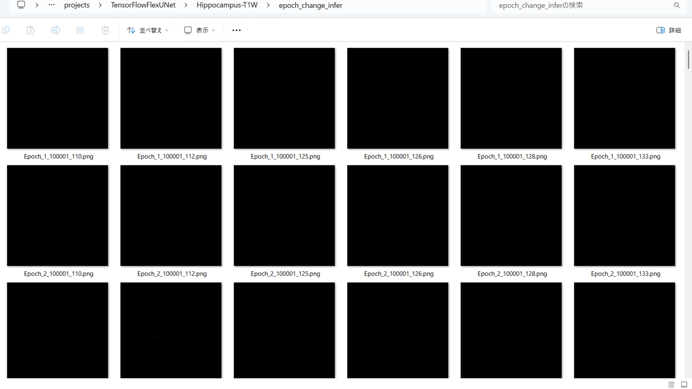 
 
<b>Epoch_change_inference output at middle-point (23,24,25)</b> 
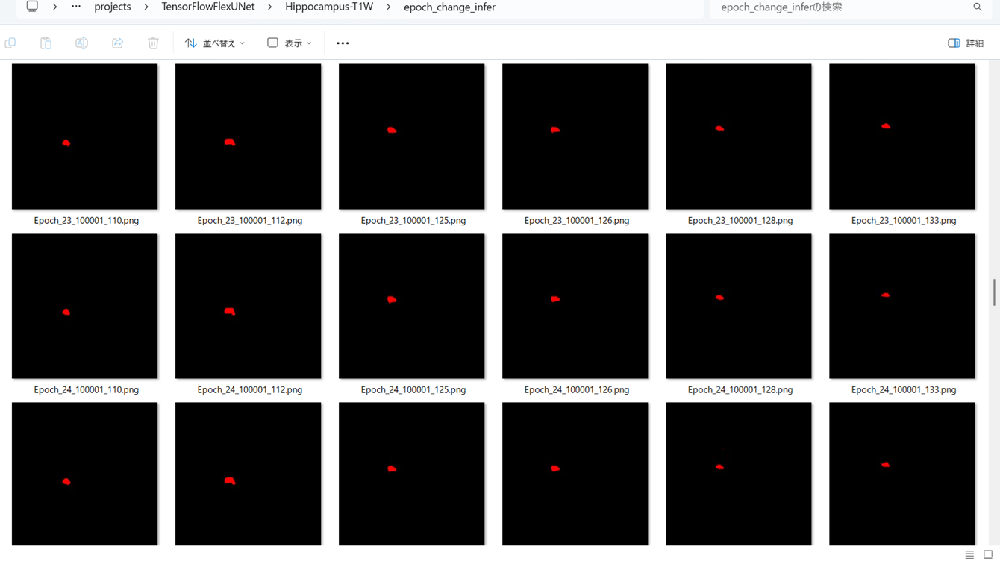 
 
<b>Epoch_change_inference output at ending (47,48,49)</b> 
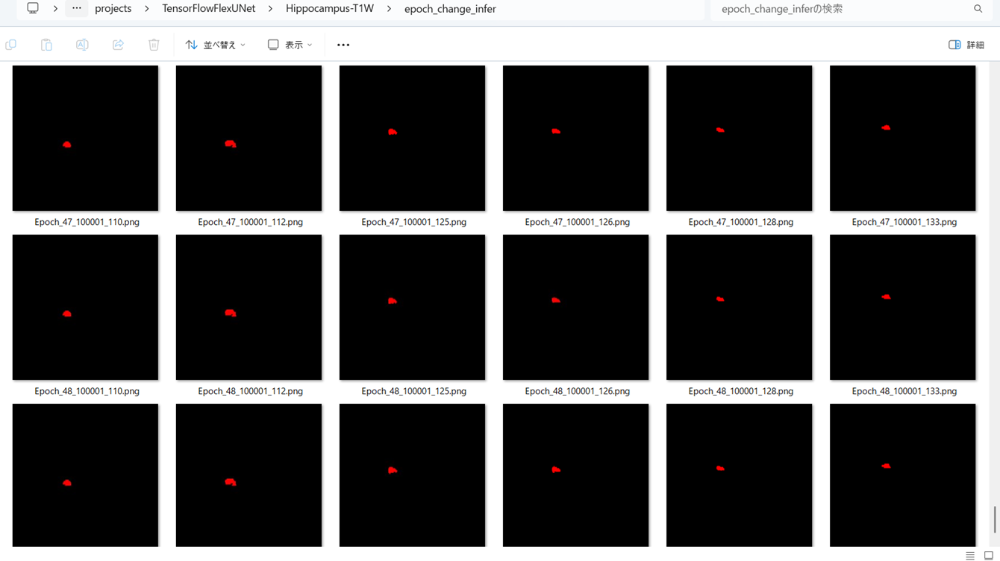 

 
In this experiment, the training process was stopped at epoch 49 by EarlyStoppingCallback.  
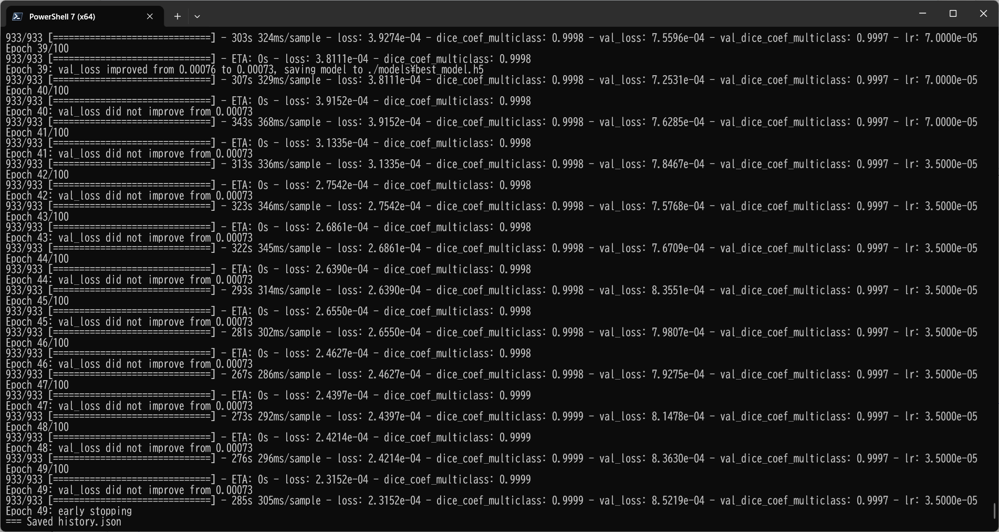 
 
<a href="./projects/TensorFlowFlexUNet/Hippocampus-T1W/eval/train_metrics.csv">train_metrics.csv</a> 
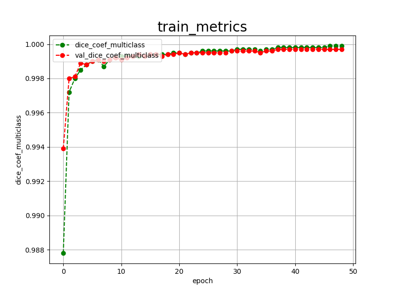 

 
<a href="./projects/TensorFlowFlexUNet/Hippocampus-T1W/eval/train_losses.csv">train_losses.csv</a> 
 
 
<h3>
4 Evaluation
</h3>
Please move to a <b>./projects/TensorFlowFlexUNet/Hippocampus-T1W</b> folder, and run the following bat file to evaluate TensorflowFlexUNet model for Hippocampus-T1W. 
<pre>
>./2.evaluate.bat
</pre>
This bat file simply runs the following command.
<pre>
>python ../../../src/TensorFlowFlexUNetEvaluator.py  ./train_eval_infer.config
</pre>
Evaluation console output: 
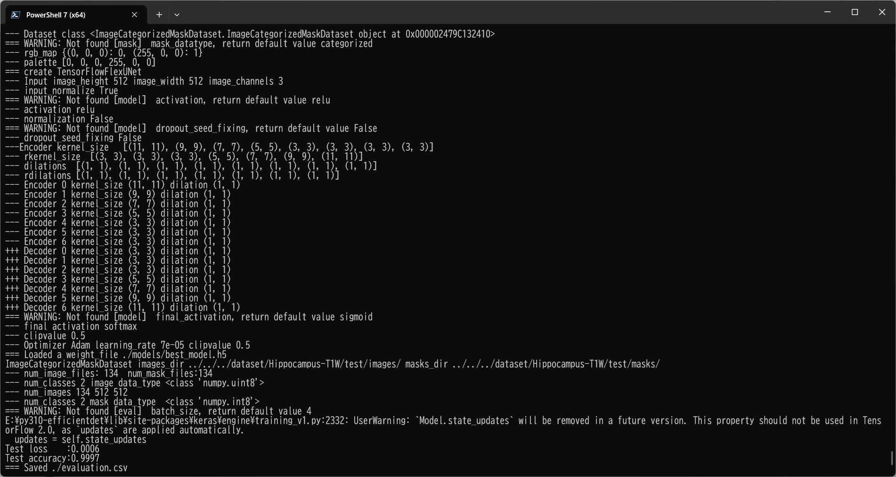
  Image-Segmentation-Hippocampus-T1W

<a href="./projects/TensorFlowFlexUNet/Hippocampus-T1W/evaluation.csv">evaluation.csv</a> 
The loss (categorical_crossentropy) to this Hippocampus-T1W/test was not so low, but dice_coef_multiclass  high as shown below.
 
<pre>
categorical_crossentropy,0.0006
dice_coef_multiclass,0.9997
</pre>
 
<h3>5 Inference</h3>
Please move to a <b>./projects/TensorFlowFlexUNet/Hippocampus-T1W</b> folder, and run the following bat file to infer segmentation regions for images by the Trained-TensorflowFlexUNet model for Hippocampus-T1W. 
<pre>
>./3.infer.bat
</pre>
This simply runs the following command.
<pre>
>python ../../../src/TensorFlowFlexUNetInferencer.py ./train_eval_infer.config
</pre>

<b>mini_test_images</b> 
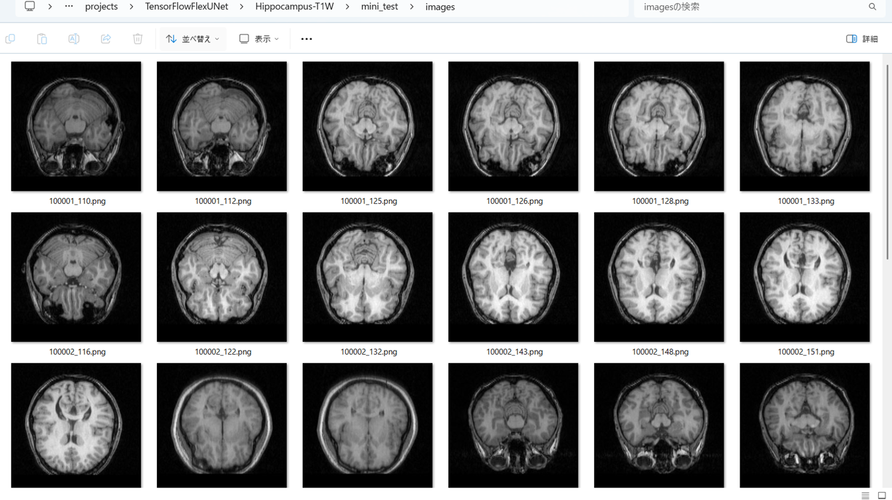 
<b>mini_test_mask(ground_truth)</b> 
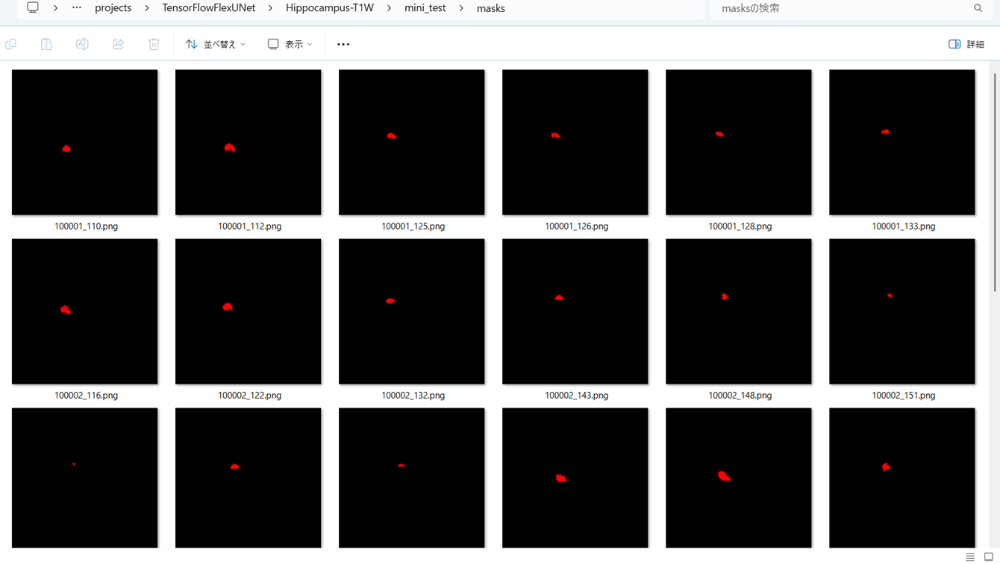 

<b>Inferred test masks</b> 
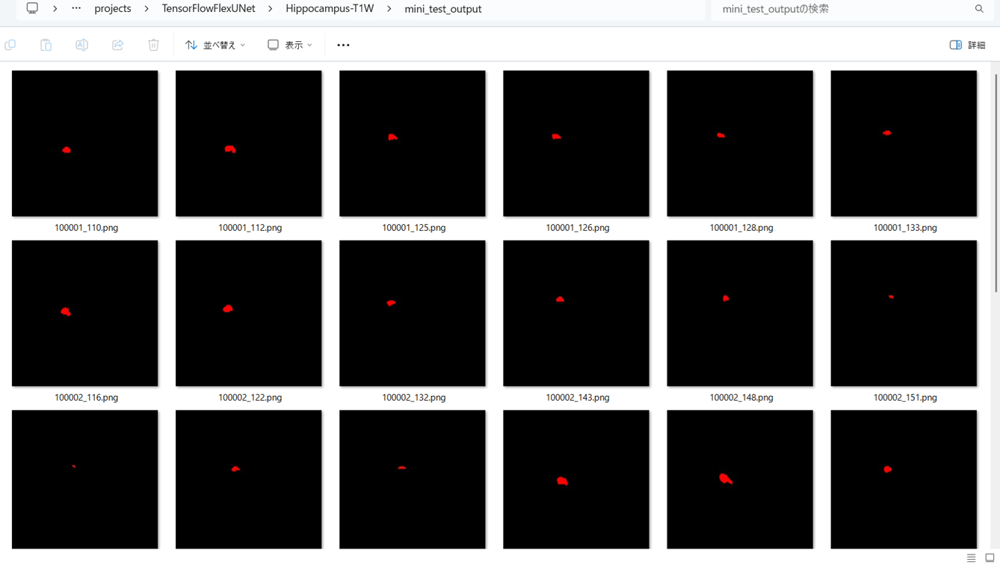 
 

<b>Enlarged images and masks for  Hippocampus-T1W  Images of 512x512 pixels</b> 
As shown below, the inferred masks predicted by our segmentation model trained by the dataset appear similar to the ground truth masks.
 
 
<table>
<tr>
<th>Input: image</th>
<th>Mask (ground_truth)</th>
<th>Prediction: inferred_mask</th>
</tr>
<tr>
<td></td>
<td></td>
<td></td>
</tr>

<tr>
<td>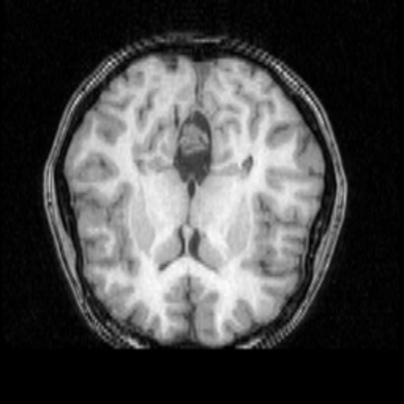</td>
<td></td>
<td></td>
</tr>

<tr>
<td></td>
<td></td>
<td></td>
</tr>
<tr>
<td>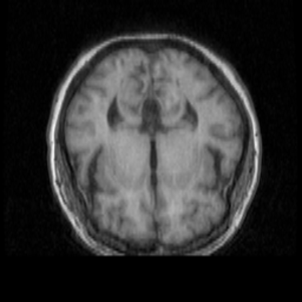</td>
<td></td>
<td></td>
</tr>
<tr>
<td>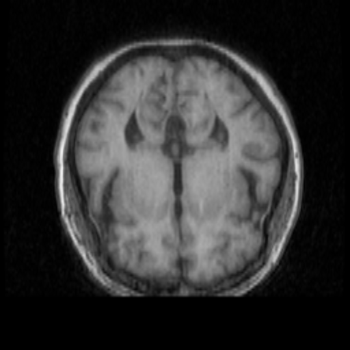</td>
<td></td>
<td></td>
</tr>
<tr>
<td>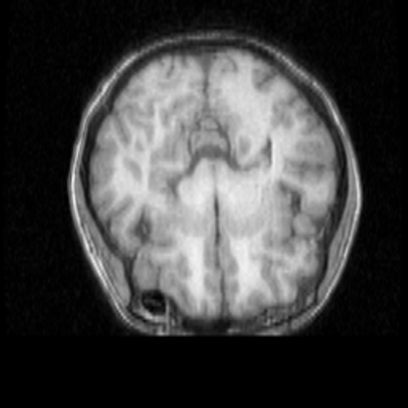</td>
<td></td>
<td></td>
</tr>
</table>

 
<h3>
References
</h3>
<b>1. DATASET OF MAGNETIC RESONANCE IMAGES OF NONEPILEPTIC SUBJECTS AND TEMPORAL LOBE EPILEPSY PATIENTS 
FOR VALIDATION OF HIPPOCAMPAL SEGMENTATION TECHNIQUES</b> 
Kourosh Jafari-Khouzani, Kost V Elisevich, Suresh Patel, Hamid Soltanian-Zadeh  
<a href="https://pmc.ncbi.nlm.nih.gov/articles/PMC4501402/">
https://pmc.ncbi.nlm.nih.gov/articles/PMC4501402/</a>
  

<b>2.  Hippocampus Segmentation Using U-Net Convolutional Network from Brain Magnetic Resonance Imaging (MRI)</b> 
Ruhul Amin Hazarika, Arnab Kumar Maji, Raplang Syiem, Samarendra Nath Sur, Debdatta Kandar  
<a href="https://pmc.ncbi.nlm.nih.gov/articles/PMC9485390/">
https://pmc.ncbi.nlm.nih.gov/articles/PMC9485390/</a>
  
<b>3. Fully Automated Hippocampus Segmentation using T2-informed Deep Convolutional Neural Networks</b> 
Maximilian Sackl, Christian Tinauer, Martin Urschler, Christian Enzinger, Rudolf Stollberger, Stefan Ropele  
<a href="https://www.sciencedirect.com/science/article/pii/S1053811924002647">
https://www.sciencedirect.com/science/article/pii/S1053811924002647</a>
  
<b>4. TensorFlow-FlexUNet-Image-Segmentation-Model</b> 
Toshiyuki Arai  
<a href="https://github.com/sarah-antillia/TensorFlow-FlexUNet-Image-Segmentation-Model">
TensorFlow-FlexUNet-Image-Segmentation-Model
</a>
 
 
